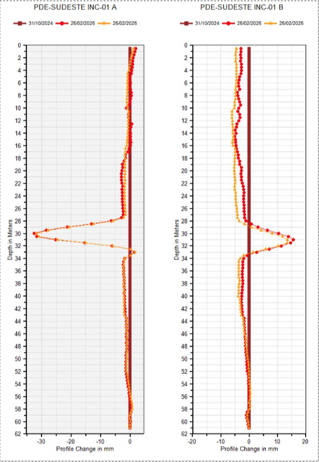
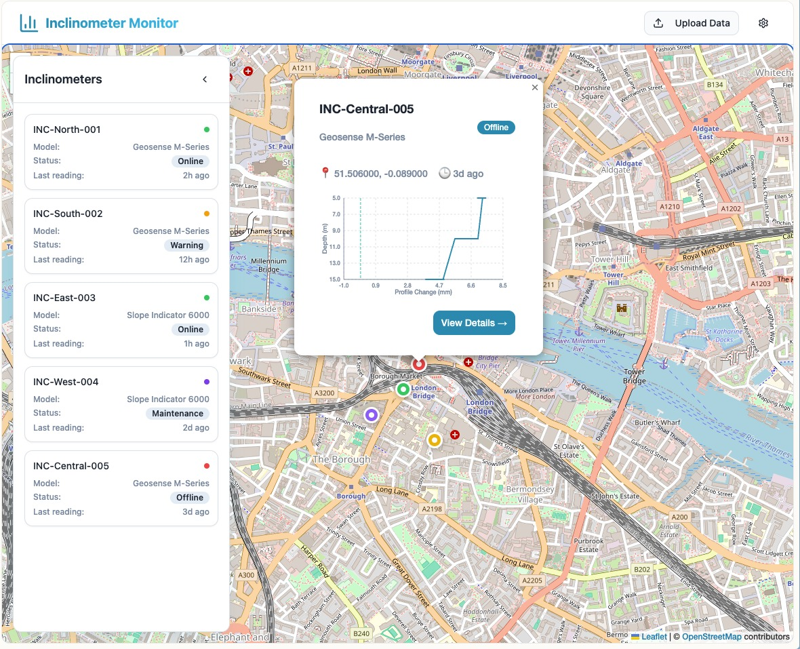
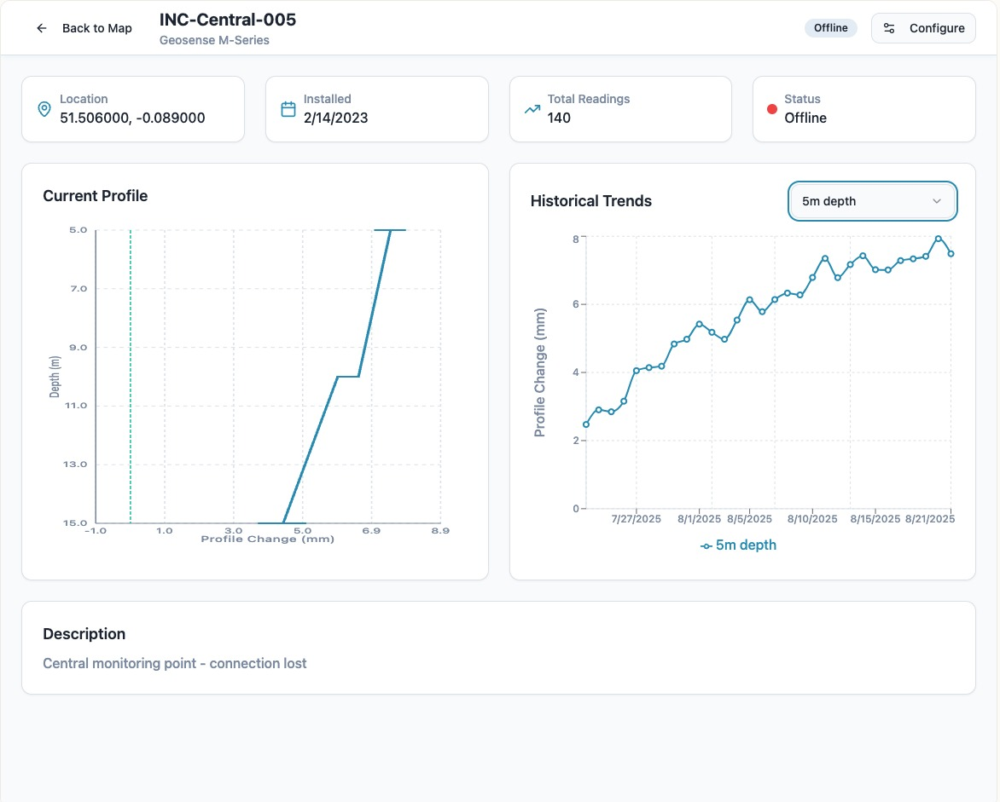
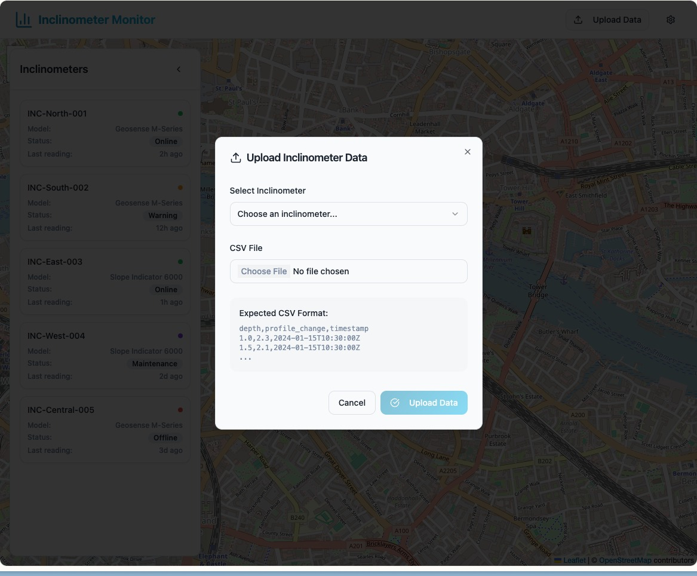

# Especificação Técnica — Sistema de Monitoramento Geotécnico (v0.0)

- [Especificação Técnica — Sistema de Monitoramento Geotécnico (v0.0)](#especificação-técnica--sistema-de-monitoramento-geotécnico-v00)
  - [1 Contexto](#1-contexto)
  - [2 Objetivos](#2-objetivos)
  - [3 Escopo](#3-escopo)
    - [3.1 Incluído](#31-incluído)
    - [3.1 Não incluído (previsto para versões futuras)](#31-não-incluído-previsto-para-versões-futuras)
  - [4 Usuários e Perfis de Acesso](#4-usuários-e-perfis-de-acesso)
    - [4.1 Administrador](#41-administrador)
    - [4.2 Usuário](#42-usuário)
  - [5 Requisitos Funcionais](#5-requisitos-funcionais)
    - [5.1	Autenticação e autorização (login e permissões)](#51autenticação-e-autorização-login-e-permissões)
    - [5.2	Projetos](#52projetos)
    - [5.3	Importação de leituras de inclinômetros](#53importação-de-leituras-de-inclinômetros)
    - [5.4 Visualização em mapa](#54-visualização-em-mapa)
    - [5.5 Popup do mapa](#55-popup-do-mapa)
    - [5.6 Página de detalhamento do instrumento](#56-página-de-detalhamento-do-instrumento)
    - [5.7 Menu lateral de listagem de instrumentos](#57-menu-lateral-de-listagem-de-instrumentos)
    - [5.8 Visualização de leituras](#58-visualização-de-leituras)
  - [6 Requisitos Não Funcionais](#6-requisitos-não-funcionais)
    - [6.1 Tecnologia](#61-tecnologia)
    - [6.2 Validação](#62-validação)
    - [6.3 Idiomas da interface:](#63-idiomas-da-interface)
    - [6.4 Segurança](#64-segurança)
  - [7 Interface](#7-interface)
  - [8 Gráficos](#8-gráficos)
    - [8.1 Perfil (Profile Change)](#81-perfil-profile-change)
    - [8.2 Histórico](#82-histórico)
  - [9 Exemplos de Interface](#9-exemplos-de-interface)
  - [10 Futuras Evoluções](#10-futuras-evoluções)


## 1 Contexto

Este projeto faz parte do desenvolvimento de um **sistema integrado de monitoramento geotécnico**, para a web, que permitirá gerenciar e visualizar dados provenientes de diferentes instrumentos, como piezômetros, inclinômetros, tiltmeters, marcos superficiais, entre outros.
A ***versão 0.0*** é a primeira etapa e tem como objetivo validar a arquitetura base do sistema, a estrutura de dados e as principais interfaces. Nesta versão, o foco é exclusivo no instrumento inclinômetro, contemplando: importação manual de leituras, visualização em mapa, gráficos de perfil e evolução temporal, além de um controle simples de usuários e encapsulamento por projetos.
Versões futuras (v0.1 em diante) incluirão funcionalidades adicionais como CRUD de instrumentos via interface, suporte a outros tipos de sensores, automação de importação, alarmes, dashboards e relatórios.

## 2 Objetivos
  
  -	Permitir **importação e validação de leituras de inclinômetros** via arquivo CSV.
  -	Visualizar **instrumentos no mapa** com base em coordenadas geográficas.
  -	Exibir leituras de inclinômetros em **gráficos verticais (perfil)** e **séries temporais (histórico por profundidade)**.
  -	Implementar **controle de acesso por usuário** (usuário/administrador).
  -	Criar uma estrutura de **projetos encapsulados**, de modo que os dados sejam segregados por projeto.
  
## 3 Escopo

### 3.1 Incluído
- Controle de acesso (login por e-mail/nome de usuário + senha).
  - Autenticação por cookie de sessão
- Perfis:
  - Usuário: Visualiza instrumentos e leituras associadas ao projeto
  - Administrador: Usuário + Importa arquivos de dados.
- Importação de leituras de inclinômetro por arquivo CSV.
- Validação de arquivos antes da importação.
- Armazenamento das leituras em banco de dados (Postgres).
- Visualização de detalhes do inclinômetro.
- Visualização dos instrumentos em mapa (Leaflet + camada satelital)
  - Popup com informações do inclinômetro, gráfico simples do perfil (um para A e outro para B).
- Visualização de leituras em:
  - Perfil vertical (profundidade *x* deslocamento nos eixos A e B).
  - Série temporal (profundidade fixa *x* tempo);
- Filtros:
  - Filtragem de leituras por data.
  - Downsampling ajustável pelo usuário (nível de amostragem).
  - Filtragem de instrumentos no mapa.

### 3.1 Não incluído (previsto para versões futuras)

- CRUD de instrumentos via interface.
- Suporte a outros tipos de sensores.
- Relatórios, exportação de dados, alarmes e dashboards.
- RBAC avançado.

## 4 Usuários e Perfis de Acesso

### 4.1 Administrador

- Importar arquivos CSV de leituras

### 4.2 Usuário

-	Acessar apenas projetos aos quais tem permissão
-	Visualizar instrumentos no mapa.
-	Visualizar gráficos de leituras.
-	Visualizar detalhes dos instrumentos.

## 5 Requisitos Funcionais

### 5.1	Autenticação e autorização (login e permissões) 

1.	Autenticar usuário por e-mail/nome de usuário + senha.
2.	Definição de perfil para o usuário (usuário ou administrador).

### 5.2	Projetos

1. Garantir isolamento de dados por projeto

### 5.3	Importação de leituras de inclinômetros

1.	Upload de arquivos CSV com cabeçalho padrão:

    ```csv
    <!-- Exemplo -->

    PDE-SUDESTE INC-01 A
    Depth in Meters,Profile_Change,Units:,Profile Change in mm
    Depth,31/10/2024 10:32,31/10/2024 12:33,31/10/2024 20:47,...
    0.5,0,-0.62,-3.15,-2.29,-0.36,1.12,-0.78,...
    1,0,-0.63,-3.17,-2.3,-0.4,1.08...
    ...

    PDE-SUDESTE INC-01 B
    Depth in Meters,Profile_Change,Units:,Profile Change in mm
    Depth,31/10/2024 10:32,31/10/2024 12:33,31/10/2024 20:47,...
    0.5,0,-0.81,-1.56,-0.17,0.14,-0.31,-3.66,5.23,-2...
    1,0,-0.81,-1.55,-0.35,0.02,-0.41,-3.27,5.1,...
    ...
    ```

    > Formato:
    > 
    > Depth,[dd/mm/yyyy HH:MM...]
    >
    > valor_depth,[valor_data...]

2. Validação de formato de data (dd/mm/yyyy HH:MM).
3. Armazenamento das leituras em estrutura relacional.
4. Seleção de instrumento para o qual deseja importar os dados.

### 5.4 Visualização em mapa
  1. Exibir instrumentos cadastrados com base em coordenadas (lat/long).
  2. Deve permitir filtragem de instrumentos por atributos básicos.
  3. Mapa base: Leaflet com camada satelital.

### 5.5 Popup do mapa
  1. Deve ser possível clicar em marcador no mapa (instrumento) e abrir um popup com o gráfico de profundidade (eixos A e B) mostrando as últimas 5-10 leituras, e algumas informações básicas do instrumento.
  2. A partir desse popup deve ser possível navegar para a página de detalhamento do instrumento.
   
### 5.6 Página de detalhamento do instrumento

1. Mostrar informações do instrumento.
2. Mostar gráficos (A e B) de profundidade x deslocamento, com seleção de leituras.
3. Mostrar gráficos de histórico para determinadas profundidades, com seleção de profundidade.
4. Deve ser possível navegar de volta para o mapa, com foco no instrumento.

### 5.7 Menu lateral de listagem de instrumentos

1. Na página do mapa deve ter um menu lateral para visualizar em lista os instrumentos.
2. Deve permitir filtragem dos instrumentos.
   
### 5.8 Visualização de leituras

1. **Perfil vertical**: gráfico com profundidade (Y) x deslocamento (X).
2. **Histórico temporal**: gráfico de séries temporais para múltiplas profundidades.
3. **Amostragem**: usuário ajusta a quantidade de pontos exibidos.
4. **Filtros**: filtragem por data.

## 6 Requisitos Não Funcionais

### 6.1 Tecnologia
- Plataforma: **Web**
- Backend: 
  - **Go**
  - Framework Echo
  - SQLC para queries
  - ORM BobDB 
- Frontend: 
  - **SvelteKit**
  - Tailwind
  - Shadcn Svelte
- Banco de dados: 
  - **PostgreSQL** (RDS)
  - DBMate para migrações
- Mapas: **Leaflet**
- Hospedagem: **AWS**
  - Backend: Lambda + API Gateway
  - Frontend: SST (Lambda + Cloudfront)
- Controle de versão e hospedagem de código:
  - Git
  - GitHub

### 6.2 Validação

> Rejeitar arquivos de dado com formato inválido ou dados inconsistentes.

### 6.3 Idiomas da interface: 

- Inglês

### 6.4 Segurança

- Armazenamento seguro de senhas (hash + salt).
- HTTPS

## 7 Interface
- **Mapa**: 
  - Exibe instrumentos como marcadores clicáveis.
  - Exibe menu lateral com instrumentos.
- **Tela do instrumento**: 
  - Informações do instrumento.
  - Seção Perfil: gráfico vertical (profundidade x deslocamento).
  - Seção Histórico: gráfico de séries temporais para as profundidades selecionadas.
- **Tela de upload**: dropdown para seleção e envio de arquivo CSV, com feedback de validação.
- **Tela de login**.

## 8 Gráficos

### 8.1 Perfil (Profile Change)

Y invertido (profundidade em m), X=deslocamento em mm; Eixos A/B separados.

Exemplo de gráfico de perfil.



### 8.2 Histórico

Y=mm, X=data/hora; múltiplas profundidades.

## 9 Exemplos de Interface

> Os exemplos devem servir apenas de inspiração para o desenvolvimento, e não representam o objetivo do sistema por completo.

Mapa com marcadores, popup e barra lateral.


Tela com detalhes do instrumento e gráficos.


Tela de upload de dados.



## 10 Futuras Evoluções

- CRUD completo de instrumentos via interface (v0.1).
- Suporte a múltiplos tipos de sensores (piezômetros, tiltmeters, etc.).
- Relatórios, dashboards e alarmes automáticos.
- Importação automática e integração com APIs externas.
- Responsividade plena para dispositivos móveis.
- Exportação de dados em CSV/Excel/PDF.


